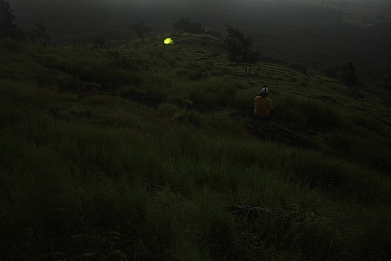
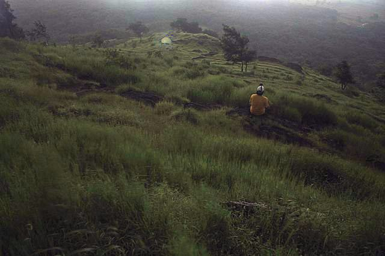

# Low-Illumination-Image-Enhancement
Here I present a project on Low Illumination Image Enhancement based on the paper "Nighttime low illumination image  enhancement with single image using  bright/dark channel prior."

## Authors
This project was made by Oriol Josa and Lourdes Simón.

## Brief summary

We reproduce a method of nighttime low-illumination image enhancement based on the use of bright and dark channels. Our starting point is an RGB image (I) with which we obtain a first approximation of the transmission (t) based on the bright channel (Ibright). Then we use the dark channel (Idark) to correct errors in the initial transmission estimate. Next, we apply a guided filter to improve the transmission. Finally, we obtain the well-exposed image (J) from the original image, the transmission, and an atmospheric light estimation (A). In the results obtained, we observe a clear improvement in the image’s exposure.

You can find more information and a detailed explanation of the method in the document called "Final Project on Low Illumination Image Enhancement - Lourdes and Oriol".

At the end of the code you will find alternative ways to do some procedures that were discarted as we found a way which provided us with better or very similar results.

## Example Result
Below there is an example of our method results. More images can be found in the "images" folder.

   
  

